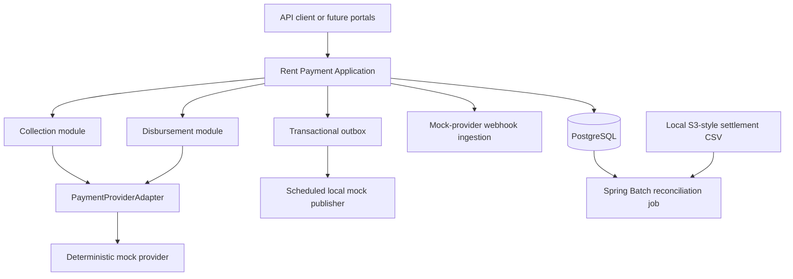
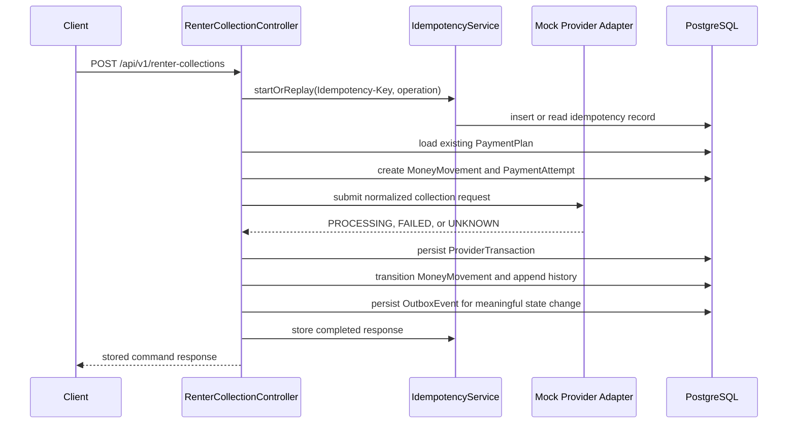
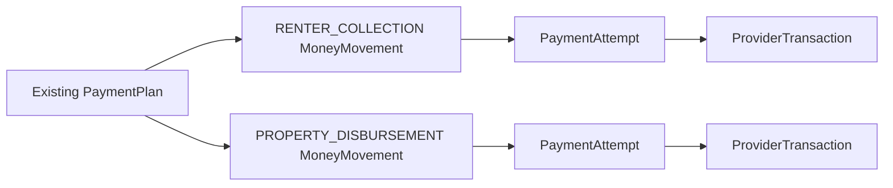
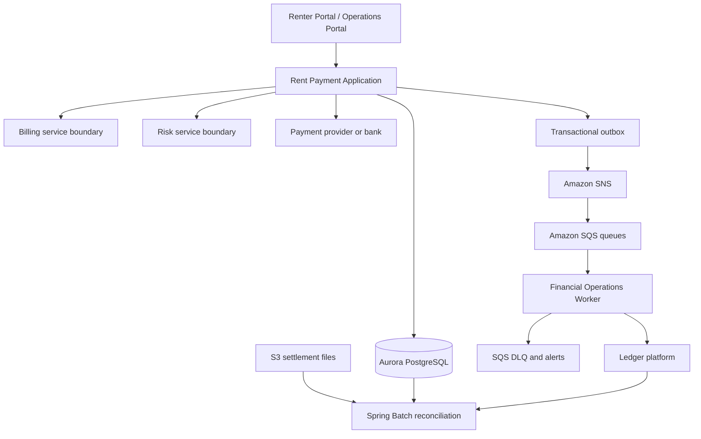

# Rent Payment Financial Platform

This repository implements the modular Spring Boot Rent Payment Application described in
[`docs/Flex_Rent_Payment_Project_Blueprint.md`](docs/Flex_Rent_Payment_Project_Blueprint.md).
The blueprint remains the canonical source of truth for scope, architecture decisions,
technology choices, and interview narrative.

Current implementation checkpoint: **Phase 1 Tasks 1-12**.

For a fuller Phase 1 documentation checkpoint and full-stack roadmap, see
[`docs/Phase_1_Documentation_Checkpoint.md`](docs/Phase_1_Documentation_Checkpoint.md).

## Project Purpose

The project models the payment-side platform behind a rent-payment product. It focuses
on payment orchestration and financial operations, not underwriting, the renter mobile
app, or complete Billing/Risk/Ledger ownership.

Implemented Phase 1 flows:

- Store payment-side snapshots of upstream Billing payment plans.
- Create renter collection money movements against existing payment plans.
- Create property disbursement money movements against existing payment plans.
- Submit those movements to a deterministic mock provider adapter.
- Track attempts, provider references, state history, webhooks, outbox events,
  settlement expectations, and reconciliation outcomes.

Billing, Risk, and Ledger remain external/shared boundaries. The application does not
create unnecessary microservices and does not introduce Kafka, Eureka, OpenFeign,
ShardingSphere, Saga, Redis, DynamoDB, Snowflake, Terraform, or AWS CDK for Phase 1.

## Current Architecture



The code is one Spring Boot deployable organized into explicit modules:

- `paymentplan`: payment-side snapshot of upstream Billing obligations
- `collection`: renter collection command API
- `disbursement`: property disbursement command API
- `provider`: provider adapter contract, normalized models, mock adapter
- `webhook`: mock-provider webhook verification, persistence, deduplication
- `idempotency`: stable request fingerprinting and replay handling
- `outbox`: transactional event persistence and scheduled local publishing
- `settlement`: expected settlement record creation
- `reconciliation`: chunk-oriented Spring Batch settlement-file reconciliation
- `shared`: domain enums, money movement entities, state-transition service, API errors

## End-to-End Flows

### Renter Collection



The collection API assumes the `PaymentPlan` already exists. PaymentPlan creation belongs
to the upstream Billing domain and is intentionally out of scope for this service.

### Property Disbursement

Property disbursement follows the same command pattern but creates an independent
`PROPERTY_DISBURSEMENT` money movement. The disbursement amount comes from the
payment-side `PaymentPlan` rent amount, while renter collection uses the initial
collection amount.



## Provider Adapter And Result Handling

The provider boundary is represented by `PaymentProviderAdapter` plus normalized
request/response records. The current implementation is a deterministic mock provider.

Mock provider scenarios are selected by `operationKey`:

- Default keys return an accepted `PROCESSING` provider result.
- Keys containing `mock-fail` return a definitive failure.
- Keys containing `mock-timeout` return an ambiguous timeout.

Provider submission persists:

- `PaymentAttempt`
- `ProviderTransaction`
- `MoneyMovement` state update
- `MoneyMovementStateHistory`
- `OutboxEvent` for meaningful movement state changes

Ambiguous timeout is not blindly marked failed and is not retried in Phase 1. It is stored
as provider status `UNKNOWN` with an ambiguous payment attempt, leaving final resolution
to a later provider-status verification or webhook workflow.

## Idempotency

Collection and disbursement endpoints require:

```text
Idempotency-Key: <stable client key>
```

The JSON body still carries `operationKey` for backward compatibility and provider
idempotency derivation.

Implemented behavior:

- Database uniqueness on `(idempotency_key, operation)`
- Stable normalized request fingerprinting
- Insert-race handling for concurrent duplicate requests
- Completed duplicate request replay returns the original stored response
- Conflicting key reuse returns `409`
- In-flight duplicate request returns `409`
- Expired key reuse returns `409`
- Expiration timestamp is persisted on `IdempotencyRecord`

## Webhook Ingestion

Mock-provider webhooks are accepted at:

```text
POST /api/v1/provider-webhooks/mock-provider
X-Mock-Provider-Signature: <shared secret>
```

Payload:

```json
{
  "providerEventId": "event-123",
  "providerTransactionId": "mock-txn-123",
  "providerStatus": "SUCCEEDED",
  "occurredAt": "2026-08-01T12:00:00Z"
}
```

Implemented behavior:

- Minimal shared-secret signature verification
- Raw payload persistence in `provider_webhook_events`
- Database uniqueness on `(provider, provider_event_id)`
- Idempotent duplicate delivery handling
- Provider transaction lookup
- Updates to `ProviderTransaction`, `PaymentAttempt`, `MoneyMovement`, and state history
- Terminal-state and invalid-regression protection
- Unknown provider transactions are persisted as `UNMATCHED`
- Ignored invalid-regression events remain available for investigation
- `occurredAt`-based stale-event detection remains future work

## State Transitions

`MoneyMovementStateTransitionService` centralizes:

- Valid transition rules
- MoneyMovement mutation
- State-history creation
- Invalid-regression rejection
- No-op transition handling
- Transactional outbox event creation for meaningful state changes

Same-state transitions such as `PROCESSING -> PROCESSING` do not create duplicate
state-history rows by default. Webhook audit details remain in `ProviderWebhookEvent`.

## Transactional Outbox

Meaningful money-movement state changes create an `OutboxEvent` in the same PostgreSQL
transaction as the movement update and state-history row.

Outbox events use:

- aggregate type: `MoneyMovement`
- aggregate ID: the money movement ID
- event type: `money-movement.state-changed`
- payload: stable JSON stored at transition time
- status: `PENDING`
- attempts: `0`
- `next_attempt_at` for retry eligibility

No event is emitted for no-op transitions, rejected transitions, duplicate webhook replay,
unmatched webhooks, ignored invalid-regression webhooks, or idempotent API replay.

## Scheduled Outbox Publishing

`ScheduledOutboxPublisher` polls eligible pending outbox rows and delegates to
`OutboxPublisher`.

Implemented behavior:

- PostgreSQL `FOR UPDATE SKIP LOCKED` claiming to avoid duplicate publication from
  overlapping scheduler executions
- Local mock `EventPublisher`
- Stored payload is published without rebuilding it
- Successful rows become `PUBLISHED` with `published_at`
- Failed rows increment `attempts`, store `last_error`, and set `next_attempt_at`
- Exhausted rows become `FAILED`

Real SNS/SQS publishing and consumers remain future production-direction work.

## Settlement Expectations

When a provider-backed money movement reaches `SUCCEEDED`, the application creates one
`SettlementRecord` with status `EXPECTED`.

The record captures:

- expected gross amount
- expected fee amount
- expected net amount
- currency
- expected settlement date
- provider
- provider transaction reference

Duplicate webhook replay and already-existing settlement expectations do not create
additional settlement rows.

## Spring Batch Reconciliation

`providerSettlementReconciliationJob` is a chunk-oriented Spring Batch job that reads
provider settlement CSV files through a `SettlementFileSource` abstraction. The current
implementation resolves local files; the interface is ready for a future S3 source.

Current CSV format:

```text
provider,providerTransactionReference,grossAmount,feeAmount,netAmount,currency,settlementDate,providerBatchReference
mock-provider,mock-txn-123,500.00,0.00,500.00,USD,2026-08-02,batch-001
```

The job uses:

- `FlatFileItemReader`
- `ItemProcessor`
- `ItemWriter`
- configurable chunk size
- `ReconciliationRun` source-file identity
- `ReconciliationExceptionRecord` for operations review

Implemented reconciliation outcomes include matched rows, missing internal settlements,
amount mismatches, duplicate provider records, malformed-file failure, completed rerun
deduplication, and failed-run restartability.

## Persistence And Flyway

Flyway owns schema creation. Hibernate runs with `ddl-auto=validate`.

Current migrations:

| Migration | Scope |
| --- | --- |
| `V1__create_payment_core_tables.sql` | payment plans, money movements, attempts, provider transactions, state history, idempotency, outbox |
| `V2__create_provider_webhook_events.sql` | webhook event audit and provider event deduplication |
| `V3__create_settlement_records.sql` | expected and actual settlement tracking |
| `V4__create_reconciliation_tables.sql` | reconciliation runs and exception records |

Important constraints include:

- `payment_plans.billing_obligation_id`
- `money_movements.operation_key`
- `payment_attempts(money_movement_id, attempt_number)`
- `provider_transactions(provider, provider_transaction_id)`
- `provider_transactions(provider, provider_idempotency_key)`
- `idempotency_records(idempotency_key, operation)`
- `provider_webhook_events(provider, provider_event_id)`
- `settlement_records.money_movement_id`
- `settlement_records.provider_transaction_id`
- `reconciliation_runs.source_file`
- `reconciliation_exceptions(reconciliation_run_id, provider, provider_transaction_reference, exception_type)`

## Current API Endpoints

### Renter Collection

```http
POST /api/v1/renter-collections
Idempotency-Key: <key>
Content-Type: application/json

{
  "paymentPlanId": "<uuid>",
  "operationKey": "collection-001",
  "currency": "USD"
}
```

Response:

```json
{
  "moneyMovementId": "<uuid>",
  "paymentPlanId": "<uuid>",
  "type": "RENTER_COLLECTION",
  "state": "PROCESSING",
  "amount": 500.00,
  "currency": "USD",
  "operationKey": "collection-001",
  "createdAt": "2026-08-01T12:00:00Z"
}
```

### Property Disbursement

```http
POST /api/v1/property-disbursements
Idempotency-Key: <key>
Content-Type: application/json

{
  "paymentPlanId": "<uuid>",
  "operationKey": "disbursement-001",
  "currency": "USD"
}
```

### Mock Provider Webhook

```http
POST /api/v1/provider-webhooks/mock-provider
X-Mock-Provider-Signature: local-mock-webhook-secret
Content-Type: application/json

{
  "providerEventId": "event-001",
  "providerTransactionId": "mock-txn-001",
  "providerStatus": "SUCCEEDED",
  "occurredAt": "2026-08-01T12:00:00Z"
}
```

Response:

```json
{
  "result": "APPLIED"
}
```

Webhook response results:

- `APPLIED`: the webhook matched a provider transaction and applied a valid state update.
- `DUPLICATE`: the provider event was already received and no second update was applied.
- `UNMATCHED`: the provider transaction was unknown; the raw event was retained for investigation.
- `IGNORED`: the event matched a provider transaction but was not allowed to regress or mutate a terminal state.

## Local Development

The application defaults to local PostgreSQL:

```text
url: jdbc:postgresql://localhost:5432/rent_payment
username: rent_payment
password: rent_payment
```

Environment overrides:

```text
SPRING_DATASOURCE_URL
SPRING_DATASOURCE_USERNAME
SPRING_DATASOURCE_PASSWORD
MOCK_PROVIDER_WEBHOOK_SECRET
OUTBOX_PUBLISHER_BATCH_SIZE
OUTBOX_PUBLISHER_MAX_ATTEMPTS
OUTBOX_PUBLISHER_RETRY_DELAY
OUTBOX_PUBLISHER_FIXED_DELAY
OUTBOX_PUBLISHER_SCHEDULER_ENABLED
RECONCILIATION_SETTLEMENT_CHUNK_SIZE
```

Run tests:

```bash
./gradlew clean test --no-daemon
```

Run the application after PostgreSQL is available:

```bash
./gradlew bootRun
```

There is not currently a Docker Compose file in the repository.

## Testing Strategy

Current tests use JUnit 5 and PostgreSQL Testcontainers. They exercise Flyway migrations,
Hibernate validation, repository constraints, command APIs, idempotency behavior, provider
submission side effects, webhook deduplication, state transitions, transactional outbox,
outbox publisher retries/concurrency, settlement expectation creation, and chunk-oriented
reconciliation restart behavior.

Current test classes:

- `RentPaymentFinancialPlatformApplicationTests`
- `PaymentCorePersistenceTests`
- `RenterCollectionControllerTests`
- `PropertyDisbursementControllerTests`
- `IdempotencyServiceTests`
- `MockProviderWebhookControllerTests`
- `MoneyMovementStateTransitionServiceTests`
- `OutboxPublisherTests`
- `ReconciliationJobTests`

## Implemented Versus Not Yet Implemented

Implemented:

- Phase 1 Tasks 1-12
- Modular Spring Boot backend
- PostgreSQL/Flyway persistence
- Command APIs for collection and disbursement
- Deterministic mock provider adapter
- Idempotency, webhook deduplication, state transitions, outbox, local publishing,
  settlement expectation, and chunk-oriented reconciliation
- PostgreSQL-backed integration testing

Not yet implemented:

- Real payment provider integration
- Provider status polling/resynchronization
- Scheduled renter repayment
- ACH return flow
- Refund and reversal command flows
- Real SNS/SQS publisher and consumers
- Processed-event SQS consumer deduplication table
- DLQ operational workflow
- Real S3 file source
- Auth, RBAC, renter scoping, operations query APIs
- Renter-facing portal
- Internal financial-operations portal
- Docker Compose/local full-stack orchestration
- Production deployment artifacts

## Production Architecture Direction

The blueprint direction is service-oriented, not all-microservices:



Future production concerns:

- S3-backed `SettlementFileSource`
- SNS/SQS publishing and idempotent consumers
- DLQs with operational alerting and replay procedures
- Secure secrets through environment or managed secret stores
- OAuth2/JWT authentication and role-based authorization
- Renter ownership enforcement
- Metrics, tracing, structured logs, and dashboards through Actuator, Micrometer,
  Datadog, and CloudWatch
- Containerized deployment through Docker/ECR/EKS
- Clear runbooks for ambiguous provider outcomes, webhook replay, outbox failures,
  settlement exceptions, and reconciliation failures

## Proposed Full-Stack Roadmap

Recommended frontend stack:

- React
- TypeScript
- Vite
- React Router
- TanStack Query
- A restrained component system suitable for financial operations screens

Proposed frontend structure:

```text
frontend/
  src/
    app/
    auth/
    api/
    pages/
      renter/
      ops/
    components/
      layout/
      tables/
      filters/
      status/
      money/
      forms/
      feedback/
    hooks/
    utils/
```

Recommended full-stack phases:

1. Backend read-model APIs for renter payment plans and money movements.
2. Spring Security with JWT-style local/dev auth and roles: `RENTER`, `SUPPORT`,
   `FINOPS`, `ADMIN`.
3. Renter portal vertical slice: dashboard, payment-plan detail, money-movement history,
   and collection initiation through the existing command API.
4. Operations portal read-only slice: money movements, provider transactions, webhook
   events, outbox events, settlement records, reconciliation runs, and exceptions.
5. Pagination, filtering, constrained search, and supporting database indexes.
6. Docker Compose for PostgreSQL, backend, and frontend local development.
7. Production integrations: S3, SNS/SQS, DLQ workflows, secure secrets, observability,
   and deployment artifacts.

Recommended first full-stack vertical slice:

- Add authenticated renter-scoped read APIs.
- Build a renter dashboard that lists the renter's payment plans and money movements.
- Reuse the existing renter collection command endpoint with idempotency.
- Keep payment execution, webhook, outbox, settlement, and reconciliation domain logic
  unchanged.
