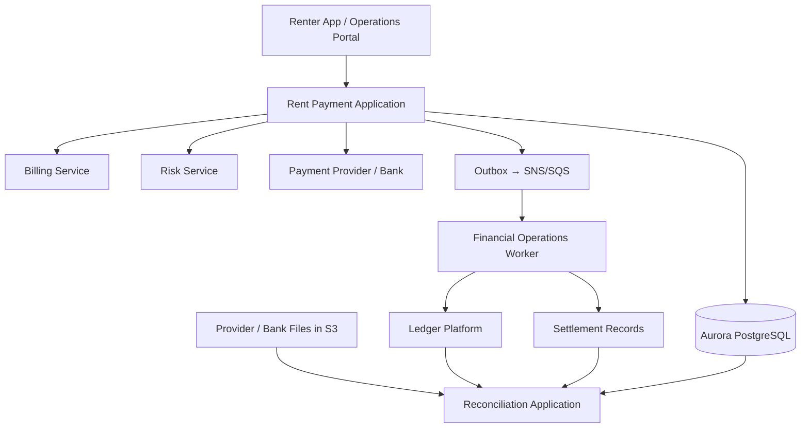

# Flex Rent Payment & Financial Operations Platform

## Canonical Project Blueprint

**Document purpose:** This is the single source of truth for implementing the project, maintaining its README and resume content, and preparing interview narratives. Future changes must remain consistent with this blueprint unless an explicit architecture decision updates it.

**Target project period:** February 2023 – September 2024  
**Company context:** Flex, an NYC-headquartered growth-stage fintech focused on improving the rent-payment experience  
**Platform:** FinPlatform  
**Team scope:** Payments & Money Movement Engineering  
**Project:** Rent Payment & Financial Operations Platform  
**Role:** Software Engineer  

> Important: Public Flex job descriptions from 2025–2026 are reference material for company terminology and current technical direction. They do not prove that every current team name, tool, or architectural choice existed unchanged during 2023–2024. This blueprint distinguishes public signals from project design decisions.

### Evidence and inference rules

This blueprint is an **evidence-based enterprise project reconstruction**: it uses Flex's publicly documented product and backend requirements, the 2023–2024 technology timeline, and established financial-platform practices to derive a coherent enterprise project. It must not drift into unsupported detail.

Important claims should be treated as one of four categories:

- **PUBLICLY CONFIRMED:** Directly supported by Flex product information, job descriptions, or other reliable public sources.
- **STRONGLY INFERRED:** Not publicly confirmed as an internal Flex implementation, but strongly implied by the product flow or required financial-system behavior, such as idempotency, provider status tracking, settlement controls, and reconciliation.
- **PROJECT DESIGN DECISION:** A concrete implementation selected for this project—such as Amazon SNS/SQS or Spring Batch—because it is technically appropriate and compatible with the public stack, even when Flex's exact historical implementation is unknown.
- **TO BE VERIFIED:** A detail that must not be fixed or repeated as fact until supporting evidence is found, including named providers, exact transaction volume, historical team names, deployment cadence, or specific incidents.

All future code, README updates, resume content, and interview preparation must remain consistent with these categories. Publicly confirmed information should anchor the project; strong inferences must follow real payment-system logic; project design decisions must be implemented and explainable; unverified details must not silently become established facts.

---

## 1. Project Mission

The platform supports the financial lifecycle behind Flex's rent-payment product:

1. A renter enrolls in a rent-payment plan.
2. Flex collects an initial installment from the renter.
3. Flex disburses the full rent amount to the property or rent-payment destination.
4. Flex collects the renter's remaining repayment later in the month.
5. Internal payment, provider, ledger, settlement, and reconciliation records remain traceable and financially consistent.

The project focuses on payment orchestration and financial operations, not the renter-facing mobile UI, underwriting model development, or property-management product as a whole.

### Canonical project description

> This project enhanced Flex's FinPlatform capabilities supporting renter installment collections, property disbursements, repayment processing, settlement tracking, and reconciliation. As part of the FinPlatform payments and money movement engineering team, I contributed to payment orchestration, provider integrations, and lifecycle management for collections and disbursements. The platform combined service-oriented Billing, Risk, and Ledger capabilities with a modular Spring Boot payment application and Amazon SNS/SQS-based financial workflows, emphasizing idempotency, transaction consistency, failure recovery, and auditability.

---

## 2. Organizational Context

### FinPlatform

FinPlatform is the broader financial-platform domain. Based on public Flex job descriptions, its responsibilities include shared capabilities around payments, billing, partner integrations, money movement, ledger, settlement, reconciliation, and financial data workflows.

### Payments & Money Movement Engineering

This project is placed within the payments and money-movement area of FinPlatform. The team owns or materially contributes to:

- Renter collections
- Property disbursements
- Scheduled repayments
- Payment-provider and banking integrations
- Provider webhook processing
- Money-movement lifecycle and state management
- Reliable financial-event delivery
- Settlement tracking
- Reconciliation integration and exception handling

### Collaborating domains

| Domain/team        | Responsibility                                     | Relationship to this project                                            |
|--------------------|----------------------------------------------------|-------------------------------------------------------------------------|
| Billing            | Rent obligations, schedules, amounts, due dates    | Supplies billing and repayment obligations                              |
| Risk               | Eligibility and risk decisions                     | Provides decisions; risk-model development is out of scope              |
| Ledger             | Shared financial posting and accounting capability | Receives reliable posting events and exposes records for reconciliation |
| Finance Operations | Settlement exceptions and manual investigation     | Uses operational and reconciliation results                             |
| Product            | Customer and business requirements                 | Defines behavior and prioritization                                     |
| QA/SDET            | Functional, integration, and failure testing       | Validates payment and provider scenarios                                |
| SRE/Platform       | Production infrastructure and reliability          | Supports EKS, monitoring, incident response, and releases               |

Do not describe Billing, Risk, Ledger, Settlement, Reconciliation, Webhook, and Idempotency as eight independently owned microservices. Some are shared services, some are internal modules, and some are worker or batch workloads.

---

## 3. Architecture Style

### Canonical architecture statement

The platform uses a **service-oriented financial architecture**, but it does not create a standalone microservice for every business capability.

It combines:

1. A modular Spring Boot Rent Payment Application for the synchronous payment path and strongly related payment data.
2. Shared service-oriented capabilities for Billing, Risk, and Ledger.
3. Amazon SNS/SQS-based asynchronous financial-event processing.
4. A Financial Operations Worker for settlement updates, ACH returns, retries, and exception handling.
5. A Spring Batch reconciliation workload for provider and bank settlement files.

### Deployment units

| Deployment unit             | Type                              | Main responsibility                                                                                                   |
|-----------------------------|-----------------------------------|-----------------------------------------------------------------------------------------------------------------------|
| Rent Payment Application    | Spring Boot API application       | Payment plans, collections, disbursements, repayments, provider APIs, webhooks, idempotency, state management, outbox |
| Financial Operations Worker | Spring Boot worker                | SQS consumers, settlement updates, ACH returns, ledger-posting delivery, retry and DLQ handling                       |
| Reconciliation Application  | Spring Batch scheduled workload   | File ingestion, matching, discrepancy creation, restartable reconciliation jobs                                       |
| Billing                     | Shared upstream service           | Billing obligations and schedules                                                                                     |
| Risk                        | Shared service                    | Eligibility/risk decisions                                                                                            |
| Ledger                      | Shared financial platform service | Auditable financial postings and accounting records                                                                   |

### High-level topology



### Key architecture rationale

- The synchronous payment path is not fragmented into many tiny services because payment-state, provider-reference, attempt, idempotency, and outbox data have strong consistency requirements.
- Shared enterprise capabilities such as Billing, Risk, and Ledger retain independent service boundaries because they serve multiple workflows and teams.
- Asynchronous workers scale independently from the API application and isolate downstream financial processing.
- Reconciliation is a batch/data-processing concern, not a conventional request-response microservice.
- No distributed transaction is assumed across an external payment provider and internal databases.

---

## 4. Rent Payment Application Modules

The Rent Payment Application is one deployable Spring Boot application organized into explicit domain modules.

```text
rent-payment-application/
├── paymentplan/
├── collection/
├── disbursement/
├── repayment/
├── provider/
├── webhook/
├── idempotency/
├── outbox/
├── operations/
└── shared/
```

### Module responsibilities

#### Payment Plan

- Stores the rent obligation, installment schedule, and relevant dates.
- Tracks the relationship between initial collection, property disbursement, and remaining repayment.
- Does not duplicate Billing's entire domain model; it stores the payment-side snapshot/reference required for execution and audit.

#### Collection

- Initiates and tracks renter fund collection.
- Stores attempts and external provider references.
- Handles synchronous results and later webhook updates.
- Supports retry only after determining whether an earlier provider request produced an external transaction.

#### Disbursement

- Initiates and tracks payment to the property or rent destination.
- Uses an independent money-movement record from renter collection.
- Prevents duplicate payouts through stable idempotency keys and provider references.

#### Repayment

- Creates and executes later-in-month repayment obligations.
- Tracks due dates, attempts, failures, and returns.
- Coordinates with Billing without copying Billing's entire implementation into the payment application.

#### Provider Integration

- Uses provider adapters behind an internal interface.
- Standardizes request/response types, provider references, error categories, and status mappings.
- Applies timeouts and controlled retry policies.
- Verifies provider status before retrying an ambiguous collection or disbursement.

#### Webhook

- Verifies signatures.
- Protects against replay.
- Deduplicates provider event IDs.
- Persists the raw event for audit and reprocessing.
- Applies only valid state transitions.
- Handles duplicate and out-of-order notifications safely.

#### Idempotency

- Uses stable operation-specific keys.
- Stores request fingerprints to reject conflicting reuse of a key.
- Uses database unique constraints as the final concurrency-safe guard.
- Returns the original result for a completed duplicate request where appropriate.

#### Outbox

- Persists outbound events in the same PostgreSQL transaction as the relevant payment-state update.
- Uses Spring Scheduling to poll unpublished events.
- Publishes events to Amazon SNS.
- Tracks publish status, attempts, timestamps, and failure details.

---

## 5. Core Domain Model

### Primary entities

| Entity                    | Purpose                                                                               |
|---------------------------|---------------------------------------------------------------------------------------|
| PaymentPlan               | Rent amount, installment structure, important dates, and aggregate status             |
| MoneyMovement             | One collection, disbursement, repayment, refund, or reversal                          |
| PaymentAttempt            | A specific attempt to execute a money movement through a provider                     |
| ProviderTransaction       | Provider reference, normalized status, raw status, and settlement reference           |
| MoneyMovementStateHistory | Append-only audit trail of state changes                                              |
| IdempotencyRecord         | Key, operation, request fingerprint, stored result/reference, and status              |
| WebhookEvent              | Raw payload, provider event ID, signature result, processing status, and timestamps   |
| OutboxEvent               | Reliable outbound financial event pending publication                                 |
| ProcessedEvent            | SQS-consumer deduplication record                                                     |
| SettlementRecord          | Expected/actual settlement amounts, fees, dates, provider batch/reference, and status |
| ReconciliationRun         | Batch execution and source-file metadata                                              |
| ReconciliationResult      | Match status and discrepancy details                                                  |

### Money movement types

- `RENTER_COLLECTION`
- `PROPERTY_DISBURSEMENT`
- `RENTER_REPAYMENT`
- `REFUND`
- `REVERSAL`

### Canonical money-movement states

- `CREATED`
- `SUBMITTED`
- `PROCESSING`
- `SUCCEEDED`
- `FAILED`
- `RETURNED`
- `REVERSED`

Not every transition is valid. State transitions must be explicitly defined and tested. For example, `SUCCEEDED → PROCESSING` is invalid, while a later ACH return may produce `SUCCEEDED → RETURNED` if the business model and provider behavior require it.

---

## 6. Critical Workflows

### 6.1 Initial renter collection

1. Receive a collection command with a stable idempotency key.
2. Validate the request and related payment plan.
3. Check or create the idempotency record.
4. Create the money movement and first payment attempt.
5. Call the payment-provider adapter.
6. Persist the provider reference and normalized state.
7. Persist an outbox event in the same local transaction as the state update.
8. Return the accepted or completed result.
9. Process later provider webhooks idempotently.

### 6.2 Property disbursement

1. Confirm the payment plan is eligible for disbursement.
2. Create an independent `PROPERTY_DISBURSEMENT` money movement.
3. Use a deterministic payout idempotency key.
4. Submit through the provider/banking adapter.
5. If the call times out, query by idempotency key or provider reference before retrying.
6. Persist state and outbox event atomically.
7. Track later settlement independently from execution success.

### 6.3 Scheduled renter repayment

1. Obtain the repayment obligation and due date from the payment-plan/Billing context.
2. Create a `RENTER_REPAYMENT` money movement.
3. Execute and track one or more payment attempts.
4. Process immediate failure, asynchronous completion, or ACH return.
5. Create operational exceptions for nonrecoverable or exhausted failures.

### 6.4 Webhook processing

1. Verify signature before applying business changes.
2. Persist raw event and provider event ID.
3. Deduplicate using a unique constraint.
4. Locate the provider transaction/money movement.
5. Map provider status to the internal state model.
6. Reject or safely ignore invalid/outdated transitions.
7. Update state/history and create outbox event in one local transaction.

### 6.5 Outbox and financial events

1. Business transaction writes payment changes and `OutboxEvent` atomically.
2. Spring-scheduled publisher selects pending rows in bounded batches.
3. Concurrent publishers use database locking such as `FOR UPDATE SKIP LOCKED` where supported.
4. Publisher sends to Amazon SNS and records publication status.
5. SNS fans out to purpose-specific SQS queues.
6. Each consumer inserts a `ProcessedEvent` record and applies its business update within one local transaction.
7. Unique constraints prevent concurrent duplicate consumption.
8. Exhausted failures move to a DLQ and create an operational alert/case.

### 6.6 Settlement tracking

- Payment execution success and settlement completion are separate states.
- Settlement records contain gross amount, fees, expected net amount, actual amount, expected date, actual date, and provider batch/reference.
- Provider events or settlement files update settlement state idempotently.
- Missing or mismatched settlement creates a financial-operations exception.

### 6.7 Reconciliation

1. Receive a provider or bank settlement file in Amazon S3.
2. Start a Spring Batch job with an immutable source-file identifier.
3. Read and validate records in chunks.
4. Match external records against internal money movements, settlements, and ledger references.
5. Write reconciliation results and discrepancy records.
6. Support safe restart without duplicating results.

Canonical results:

- `MATCHED`
- `MISSING_INTERNAL`
- `MISSING_PROVIDER`
- `AMOUNT_MISMATCH`
- `STATUS_MISMATCH`
- `DUPLICATE_PROVIDER_RECORD`

---

## 7. Consistency and Failure-Recovery Strategy

### Local consistency

Use a PostgreSQL transaction for strongly related updates inside the Rent Payment Application:

- Payment/money-movement state
- Payment attempt and provider reference
- State-history record
- Idempotency result where appropriate
- Outbox event

### Cross-boundary consistency

Do not claim a database rollback can undo an external payment-provider operation. Across service/provider boundaries use:

- Stable idempotency keys
- Provider transaction references
- Status verification after ambiguous timeouts
- Webhooks and status resynchronization
- Reliable outbox delivery
- Idempotent consumers
- Refunds or reversal money movements
- Reconciliation and manual exception handling

### Concurrency controls

- Database unique constraints for final idempotency enforcement
- Optimistic locking for concurrent state changes
- Conditional/validated state transitions
- Bounded retries only for classified transient failures
- No blind retry of an ambiguous financial command

### Terminology constraint

Do not use “exactly-once delivery” as a blanket claim. The project provides effectively-once business outcomes through idempotency, deduplication, transactional state updates, and reconciliation.

---

## 8. Technology Stack

### Canonical stack

- **Language/runtime:** Java 17, JVM
- **Backend:** Spring Boot, Spring MVC/Spring Web, Spring Data JPA, Hibernate
- **Scheduling/batch:** Spring Scheduling, Spring Batch
- **APIs/integration:** RESTful APIs, provider adapter pattern, webhooks
- **Database:** PostgreSQL; Amazon Aurora PostgreSQL in production
- **Schema migration:** Flyway
- **Messaging:** Amazon SNS, Amazon SQS, SQS DLQs
- **Object storage:** Amazon S3 for settlement/reconciliation files
- **Containers/orchestration:** Docker, Kubernetes, Amazon EKS, Amazon ECR
- **Observability:** Datadog, Amazon CloudWatch, Spring Boot Actuator, Micrometer
- **Build/testing:** Gradle, JUnit 5, Mockito, provider sandboxes
- **Source control:** Git

### Public-JD alignment

Public Flex job descriptions explicitly support Java, Spring core/web/boot, Gradle, JUnit, REST APIs, service-oriented architecture, message queues, scalable/distributed systems, AWS EKS, Aurora RDS, ElastiCache, DynamoDB, Docker/Kubernetes, Datadog, CI/CD, external payment-provider/banking integrations, ledger, settlement, and reconciliation concepts.

### Intentionally excluded from the canonical implementation

Do not add these merely because they appear in a current JD:

- Snowflake
- Terraform or AWS CDK
- DynamoDB
- ElastiCache
- GitHub Actions

They may be added later only when a concrete project requirement and implementation justify them. The first implementation should not become a checklist of every technology in the current JD.

### Deliberate differences from the Weee! project

| Weee! Omnichannel project                        | Flex FinPlatform project                                                               |
|--------------------------------------------------|----------------------------------------------------------------------------------------|
| Spring Cloud microservices                       | Service-oriented financial platform with a modular payment application                 |
| OpenFeign synchronous orchestration              | Provider adapters and limited shared-service REST integration                          |
| Kafka                                            | Amazon SNS and SQS                                                                     |
| Saga compensation across order/inventory/payment | Local transactions plus provider-aware recovery, refunds/reversals, and reconciliation |
| MySQL and ShardingSphere                         | PostgreSQL and Aurora PostgreSQL                                                       |
| Redis-focused cart/catalog caching               | No cache in the canonical first version                                                |
| EKS                                              | EKS also used, but deployment is not the differentiator                                |
| Order and inventory lifecycle                    | Financial money-movement, settlement, ledger, and reconciliation lifecycle             |

---

## 9. Ownership

### Canonical ownership statement

> My primary ownership was the payment and money-movement lifecycle for renter collections and property disbursements. I worked on the modular payment application, provider integrations, idempotency and state management, webhook processing, reliable financial-event delivery, and settlement/reconciliation integration. I collaborated with Billing, Risk, Ledger, Finance Operations, QA, and SRE rather than claiming ownership of those entire platforms.

### Owned or materially contributed

- Money-movement domain and persistence model
- Collection/disbursement/repayment state transitions
- Provider adapter contracts and status/error normalization
- Idempotency and concurrent-state protection
- Webhook verification, deduplication, and controlled state updates
- Transactional outbox and scheduled publisher
- SQS consumer idempotency and failure handling
- Settlement tracking integration
- Reconciliation job/matching logic or its payment-side integration
- Integration and failure-scenario tests
- Production observability and incident troubleshooting for owned flows

### Collaborated but did not wholly own

- Billing platform
- Risk models and underwriting decisions
- Company-wide Ledger platform
- Compliance policy
- EKS/platform infrastructure
- Entire reconciliation organization or finance operations process
- Renter mobile application

---

## 10. Resume Baseline

### Company line

Use a location and work-mode description that matches actual employment records. Public information identifies Flex as NYC-headquartered; do not label the company as San Francisco without supporting records.

Example format:

> Flex, New York, NY | Software Engineer | Feb 2023 – Sep 2024

If the actual arrangement was remote, state it accurately.

### Final eight bullets

1. Developed and enhanced modular rent-payment and money-movement capabilities using **Java 17**, **Spring Boot**, and **RESTful APIs**, supporting renter installment collections, property disbursements, scheduled repayments, and end-to-end payment lifecycle management.
2. Designed the money-movement domain and persistence model using **Spring Data JPA**, **Hibernate**, and **PostgreSQL**, managing installment schedules, collections, disbursements, repayment attempts, provider references, and auditable state transitions across the payment lifecycle.
3. Implemented payment idempotency and concurrency controls using stable **idempotency keys**, request fingerprinting, database **unique constraints**, and **optimistic locking**, preventing duplicate renter collections and property disbursements while protecting concurrent payment-state transitions.
4. Developed reusable provider integration adapters using **Spring Web** and **RESTful APIs** for renter collections and property disbursements, standardizing request models, provider references, status and error mappings, timeouts, and status verification before safely retrying ambiguous transactions.
5. Developed secure provider webhook processing with **signature verification**, **replay protection**, event deduplication, raw-event persistence, and controlled state transitions for asynchronous collection, disbursement, settlement, and ACH-return updates.
6. Implemented reliable event delivery using the **transactional outbox pattern**, persisting payment-state changes and outbound events within the same **PostgreSQL transaction** and publishing pending events to **Amazon SNS** through **Spring Scheduling**; built idempotent **Amazon SQS** consumers using processed-event records and database unique constraints.
7. Developed scheduled settlement and reconciliation workflows using **Spring Batch** and **Amazon S3**, matching internal money movements and ledger postings against provider and bank settlement files while identifying missing transactions, amount mismatches, duplicate records, and status discrepancies.
8. Strengthened production readiness using **JUnit 5**, **Mockito**, and provider sandbox testing for payment-state transitions, duplicate webhooks, and failure scenarios; supported containerized deployments with **Docker** and **Amazon EKS** and monitored production health through **Datadog** and **Amazon CloudWatch**.

Resume content must remain supportable by actual implementation or clearly understood project design. Do not invent performance numbers, financial volume, providers, incidents, or compliance certifications.

---

## 11. Implementation Priorities

### Phase 1 — Minimum interviewable vertical slice

Build this first:

1. Payment plan and money-movement model
2. Renter collection API
3. Property disbursement API
4. Stable idempotency keys and request fingerprints
5. Provider adapter plus mock/sandbox implementation
6. Webhook ingestion and deduplication
7. State history
8. Transactional outbox
9. SNS/SQS event flow or locally emulated equivalent
10. One settlement record flow
11. One Spring Batch reconciliation job using an S3-style input file
12. Integration tests for duplicates, concurrency, webhook replay, and rollback

### Phase 2 — Strengthening

- Scheduled renter repayment
- ACH return flow
- Refund and reversal
- Retry/DLQ operational workflow
- Provider status resynchronization
- Job restart and duplicate-file protection
- Metrics, dashboards, alerts, and tracing
- EKS deployment artifacts

### Phase 3 — Optional extensions

- Multiple provider adapters
- Dynamic routing
- Advanced fee models
- Operations portal endpoints
- Load/performance testing
- Additional ledger/reconciliation scenarios

Do not start with Phase 3.

---

## 12. Acceptance Criteria

The first complete version must demonstrate:

- A duplicate collection request does not create a second financial operation.
- A duplicate property-disbursement request does not create a second payout.
- Conflicting reuse of an idempotency key is rejected.
- Concurrent state updates cannot silently overwrite each other.
- A failed local transaction rolls back payment changes and its outbox event together.
- A successful local payment update cannot be committed without its outbox record.
- Duplicate webhook events do not repeat the business update.
- An older/out-of-order webhook cannot regress a completed state.
- Duplicate SQS delivery does not repeat ledger/settlement-side processing.
- An ambiguous provider timeout is status-checked before retry.
- Reconciliation identifies at least matched, missing, amount-mismatch, status-mismatch, and duplicate records.
- A restarted reconciliation job does not duplicate completed results.

---

## 13. Interview Narrative Guardrails

### Explain the architecture this way

> We used a service-oriented architecture, but we did not create a separate microservice for every payment capability. Strongly related payment-plan, money-movement, provider-transaction, idempotency, and outbox operations were organized within a modular Spring Boot payment application. Shared Billing, Risk, and Ledger capabilities retained independent service boundaries. Asynchronous financial processing used Amazon SNS and SQS, while settlement-file reconciliation ran as a Spring Batch workload.

### Explain consistency this way

> Inside the payment application, we used local PostgreSQL transactions for payment state, attempt history, and outbox records. Across provider and service boundaries, we relied on idempotency keys, provider references, webhooks, reliable events, controlled retries, reconciliation, and compensating financial operations rather than claiming a distributed rollback.

### Explain ownership this way

> I focused on collections, property disbursements, provider integrations, payment-state management, idempotency, webhook processing, and reliable downstream financial events. I collaborated with Billing, Risk, Ledger, Finance Operations, QA, and SRE, but I would not claim that I owned those entire platforms.

### Claims that must not be made without evidence

- A named provider such as Stripe or Adyen was used
- A precise transaction volume, TPS, revenue, or dollar amount
- Exactly-once message delivery
- PCI certification ownership
- Multi-region active-active deployment
- A current 2025–2026 team name definitely existed in 2023–2024
- Every FinPlatform capability was a microservice
- Every current Flex JD technology was used in this project

---

## 14. Instructions for Future Codex Sessions

When this file is supplied to Codex:

1. Treat it as the canonical project specification.
2. Inspect the existing repository before proposing changes.
3. Map current code to this target architecture and identify gaps.
4. Prefer minimal, coherent changes over creating many new services.
5. Keep payment-state, provider-transaction, idempotency, history, and outbox behavior transactionally consistent.
6. Preserve Billing, Risk, and Ledger as shared boundaries; use mocks/contracts when those systems are not implemented.
7. Do not introduce Kafka, Eureka, OpenFeign, ShardingSphere, or Saga merely by copying the Weee! project.
8. Do not add technology from a current JD without a concrete requirement.
9. Keep README, architecture diagrams, code, tests, resume bullets, and interview scripts mutually consistent.
10. Before declaring a phase complete, run focused tests and document what was actually verified.

### Recommended initial Codex request

> Read `Flex_Rent_Payment_Project_Blueprint.md` as the canonical target architecture. Inspect the current payment-ledger repository and produce a gap analysis that maps existing modules, entities, APIs, infrastructure, and tests to the blueprint. Do not modify code yet. Recommend the smallest implementation sequence for the Phase 1 vertical slice, identify conflicts with the blueprint, and list any decisions that require confirmation.

---

## 15. Decision Log

| Decision                                                             | Status            | Rationale                                                                       |
|----------------------------------------------------------------------|-------------------|---------------------------------------------------------------------------------|
| Project belongs to FinPlatform, focused on Payments & Money Movement | Fixed             | Matches Flex public role descriptions and project scope                         |
| Architecture is service-oriented, not all-microservices              | Fixed             | Preserves real platform boundaries without unnecessary fragmentation            |
| Rent Payment Application is modular Spring Boot                      | Fixed             | Keeps strongly related payment data and logic coherent                          |
| Billing, Risk, and Ledger are shared service boundaries              | Fixed             | They serve broader platform concerns and cross-team consumers                   |
| Messaging uses Amazon SNS/SQS                                        | Fixed for project | Differentiates from Weee! Kafka design and fits the AWS/message-queue direction |
| Reconciliation uses Spring Batch and S3-style files                  | Fixed for project | Creates a realistic, restartable financial-operations workload                  |
| Production database is Aurora PostgreSQL                             | Fixed for project | Consistent with Flex public AWS stack                                           |
| Deployment uses Docker/EKS                                           | Fixed for project | Explicitly aligned with Flex public stack                                       |
| Gradle replaces Maven                                                | Fixed             | Explicit in current public Flex backend JDs                                     |
| ElastiCache, DynamoDB, Snowflake, IaC omitted initially              | Fixed for Phase 1 | Avoids unjustified stack inflation                                              |

---

**End of canonical blueprint.**
