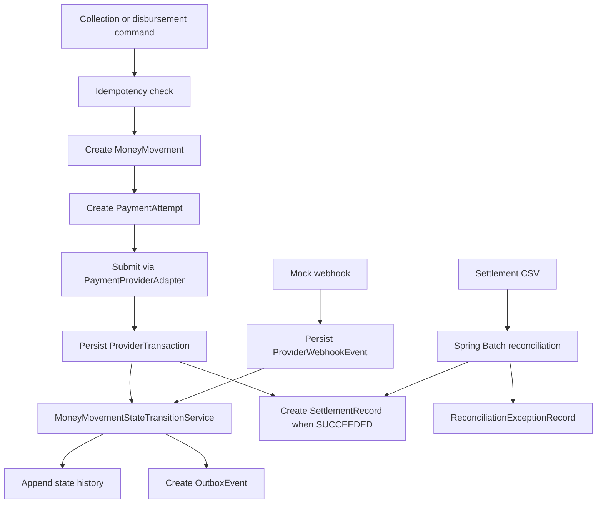
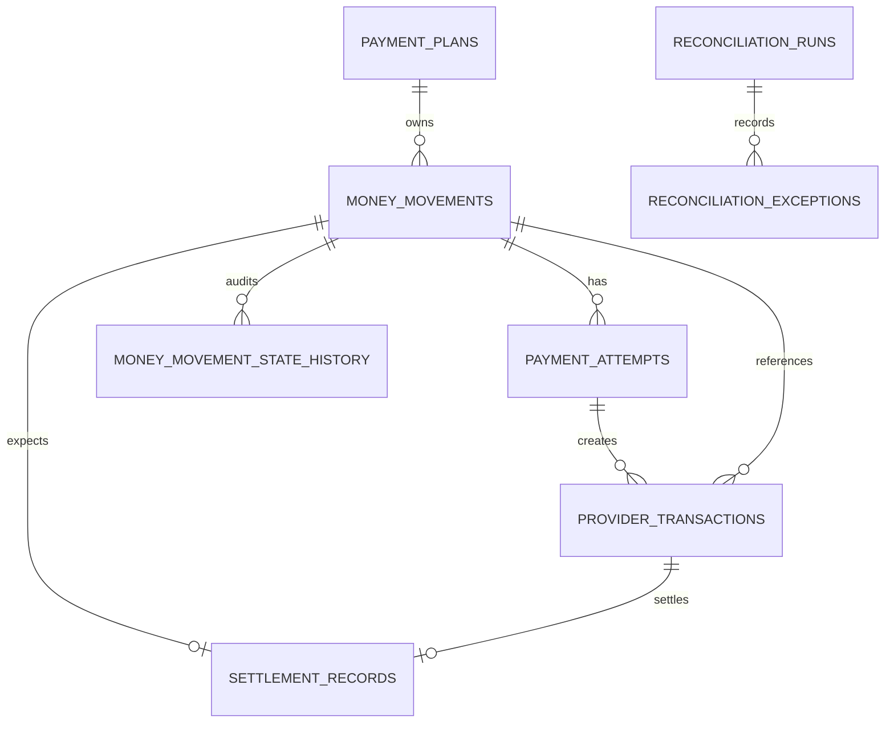
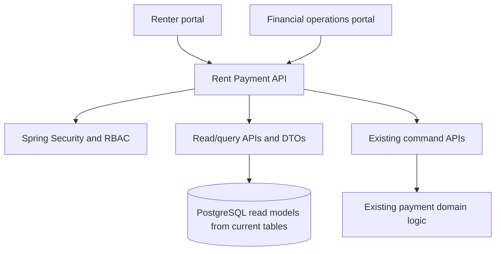

# Phase 1 Documentation Checkpoint

This document records the current repository state after Phase 1 Tasks 1-12 and the
full-stack enablement work through the renter and operations portal foundations. It is a
checkpoint for implementation planning and should remain consistent with
[`Flex_Rent_Payment_Project_Blueprint.md`](Flex_Rent_Payment_Project_Blueprint.md).

The blueprint remains canonical. This file describes what is actually implemented in
the repository today.

## Implemented Scope

Phase 1 Tasks 1-12 are implemented:

1. Payment plan and money movement model
2. Renter collection API
3. Property disbursement API
4. Stable idempotency keys and request fingerprints
5. Provider adapter plus deterministic mock implementation
6. Webhook ingestion and deduplication
7. State history and centralized transition hardening
8. Transactional outbox persistence
9. Scheduled local outbox publisher
10. One settlement record flow
11. Spring Batch reconciliation job using an S3-style input file
12. Chunk-oriented Spring Batch reconciliation hardening, including restartability,
    malformed-row handling, and integration coverage for duplicates, concurrency,
    webhook replay, rollback, publisher behavior, settlement, and reconciliation

Full-stack enablement started:

- Stateless Spring Security configuration
- Replaceable local/dev/test bearer-token principal
- Production-style OAuth2/JWT resource-server authentication path for profiles outside
  `local`, `dev`, and `test`
- Renter-scoped payment-plan and money-movement read APIs
- DTO responses for renter portal use
- Pagination through Spring `Pageable`
- Renter ownership checks for read and command endpoints
- FINOPS/ADMIN authorization for property disbursement commands
- React/TypeScript renter portal foundation under `frontend/`
- Local/dev token entry, protected renter shell, dashboard, detail pages, and renter
  collection initiation against existing APIs
- Local/dev-only demo fixture data for `renter-123`, including active and completed
  payment plans plus renter-visible money movements
- Local/dev terminal-state demo script that applies mock-provider webhooks to
  portal-created collections without adding privileged controls to the renter UI
- Secured internal operations read APIs for `SUPPORT`, `FINOPS`, and `ADMIN` covering
  money movements, provider transactions, webhook events, outbox events, settlement
  records, reconciliation runs, and reconciliation exceptions
- Read-only internal operations portal foundation under `frontend/`, including protected
  `SUPPORT`/`FINOPS`/`ADMIN` routes, operations navigation, list/detail pages, filters,
  pagination, state-history detail, and loading/empty/error/background-refresh states

## Business Scope

The implemented service supports the payment-side lifecycle for renter collections and
property disbursements against an existing payment plan. The plan itself is treated as a
payment-side snapshot of an upstream Billing obligation.

The service does not own:

- Billing obligation creation
- Risk decisions
- Ledger platform internals
- Renter mobile or web UI
- Real provider credentials or network integration
- Finance operations manual workflows

## Current Backend Modules

| Module                 | Implemented responsibility                                                  |
|------------------------|-----------------------------------------------------------------------------|
| `paymentplan`          | Payment-side plan snapshot persistence                                      |
| `collection`           | Renter collection command endpoint and service                              |
| `disbursement`         | Property disbursement command endpoint and service                          |
| `provider`             | Provider adapter contract, normalized request/response, mock provider       |
| `webhook`              | Mock-provider webhook endpoint, signature check, dedupe, audit persistence  |
| `idempotency`          | Request fingerprinting, replay, conflict handling, expiration               |
| `shared/moneymovement` | Money movement, attempts, provider transactions, state history, transitions |
| `outbox`               | Transactional event rows, scheduler, publisher, mock event sink             |
| `settlement`           | Expected settlement record creation                                         |
| `reconciliation`       | Chunk-oriented Spring Batch file reconciliation                             |
| `security`             | Stateless security configuration and replaceable dev principal              |
| `renter`               | Renter portal read/query APIs and DTOs                                      |
| `operations`           | Secured internal operations read/query APIs and DTOs                        |
| `devsupport`           | Local/dev-only demo fixture seeding for full-stack portal validation        |

## Current Frontend Module

| Module       | Implemented responsibility                                            |
|--------------|------------------------------------------------------------------------|
| `frontend`   | React/Vite renter and operations portal foundation for local/dev validation |

The frontend currently uses React, TypeScript, React Router, TanStack Query, and a Vite
dev-server proxy to the Spring Boot API. It stores a local/dev bearer token in browser
local storage, reads renter-scoped payment plans and money movements from `/api/v1/me/**`,
initiates renter collections through the existing idempotent command endpoint, and
provides read-only internal operations pages backed by `/api/v1/ops/**`.

## Current Runtime Flow



## Idempotency Checkpoint

Implemented:

- `Idempotency-Key` request header
- `operationKey` request-body field retained for API compatibility
- Normalized request fingerprinting
- PostgreSQL unique constraint on `(idempotency_key, operation)`
- Concurrent insert-race handling
- Completed response replay
- Conflicting reuse returns `409`
- In-progress duplicate returns `409`
- Expired record reuse returns `409`

Known gap:

- There is no cleanup scheduler for expired records yet.

## Provider And Webhook Checkpoint

Implemented:

- Provider adapter interface
- Deterministic mock adapter
- Normalized statuses for processing, failure, and ambiguous timeout
- Provider transaction persistence
- Ambiguous timeouts retained for later verification
- Mock-provider webhook endpoint
- Shared-secret verification
- Raw payload audit persistence
- Duplicate provider event handling through `(provider, provider_event_id)`
- Unknown transaction retention as unmatched
- Terminal-state and invalid-regression protection
- `occurredAt`-based stale-event detection remains future work

Known gaps:

- No real provider adapter
- No provider status polling
- No webhook reprocessing workflow
- No secure production secret integration

## Outbox Checkpoint

Implemented:

- Transactional outbox rows for meaningful money-movement state changes
- Stable stored JSON payload
- No event for no-op/rejected transitions or duplicate replay
- Scheduled publisher
- PostgreSQL `FOR UPDATE SKIP LOCKED` claiming
- Retry attempts, `next_attempt_at`, `last_error`, and terminal `FAILED` status
- Local mock event publisher

Known gaps:

- No real SNS publishing
- No SQS consumers
- No processed-event deduplication table
- No DLQ workflow

## Settlement And Reconciliation Checkpoint

Implemented settlement:

- One expected settlement record when a provider-backed money movement reaches
  `SUCCEEDED`
- Expected gross, fee, net, currency, settlement date, provider, and provider
  transaction reference
- Duplicate protection by money movement and provider transaction

Implemented reconciliation:

- `SettlementFileSource` abstraction
- Local file implementation
- Chunk-oriented Spring Batch job
- `FlatFileItemReader`, `ItemProcessor`, and `ItemWriter`
- Source-file uniqueness through `ReconciliationRun`
- Completed rerun deduplication
- Failed run restartability
- Malformed file failure with persisted run audit
- Missing settlement, amount mismatch, and duplicate provider-record exceptions

Known gaps:

- No real S3 implementation
- No status mismatch scenario yet
- No missing-provider comparison against expected internal records yet
- No finance operations queue or manual resolution workflow

## Persistence Model



Flyway migrations:

- `V1__create_payment_core_tables.sql`
- `V2__create_provider_webhook_events.sql`
- `V3__create_settlement_records.sql`
- `V4__create_reconciliation_tables.sql`
- `V5__add_operations_read_indexes.sql`

## Current API Surface

Command APIs:

- `POST /api/v1/renter-collections`
- `POST /api/v1/property-disbursements`
- `POST /api/v1/provider-webhooks/mock-provider`

Renter read APIs:

- `GET /api/v1/me/payment-plans`
- `GET /api/v1/me/payment-plans/{paymentPlanId}`
- `GET /api/v1/me/money-movements`
- `GET /api/v1/me/money-movements/{moneyMovementId}`

Renter list APIs default to `size=20` with newest-first sorting by `createdAt` descending.
Requested page sizes are capped at 100.

Internal operations read APIs:

- `GET /api/v1/ops/money-movements`
- `GET /api/v1/ops/money-movements/{id}`
- `GET /api/v1/ops/provider-transactions`
- `GET /api/v1/ops/provider-transactions/{id}`
- `GET /api/v1/ops/provider-webhook-events`
- `GET /api/v1/ops/provider-webhook-events/{id}`
- `GET /api/v1/ops/outbox-events`
- `GET /api/v1/ops/outbox-events/{id}`
- `GET /api/v1/ops/settlement-records`
- `GET /api/v1/ops/settlement-records/{id}`
- `GET /api/v1/ops/reconciliation-runs`
- `GET /api/v1/ops/reconciliation-runs/{id}`
- `GET /api/v1/ops/reconciliation-exceptions`
- `GET /api/v1/ops/reconciliation-exceptions/{id}`

Operations APIs require role `SUPPORT`, `FINOPS`, or `ADMIN`, return DTOs only, and use
the same default `size=20` and max `size=100` paging policy. Filters are exact-match or
bounded date/range filters for state, type, provider, status, lifecycle dates, exact IDs,
and provider references.

`V5__add_operations_read_indexes.sql` adds targeted indexes for these operations list
views, including lifecycle timestamp sorting, state/status filters, provider references,
outbox aggregate lookup, settlement provider references, and reconciliation exception
triage. Existing primary keys and unique provider-reference constraints are reused where
they already support exact lookup.

The `/api/v1/me/**` and collection endpoints require a local/dev/test bearer token with
role `RENTER`. Property disbursement requires role `FINOPS` or `ADMIN` and does not derive
renter ownership from the authenticated principal. Operations read APIs require
`SUPPORT`, `FINOPS`, or `ADMIN`. The webhook endpoint remains protected by provider
shared-secret verification.

Local/dev token format:

```text
Authorization: Bearer dev:<subject>:<renterId>:<comma-separated-roles>
```

The dev bearer-token filter is profile-gated to `local`, `dev`, and `test`; it is not
registered for production profiles.

Production-style profiles use Spring Security OAuth2 Resource Server JWT authentication.
JWT validation is configured through the standard Spring Boot issuer or JWK-set
environment settings. The JWT converter maps `sub`, `renter_id` or `renterId`, and roles
from `roles`, `authorities`, `scope`, or `scp` into the existing `ApplicationUser` model
and `RENTER`, `SUPPORT`, `FINOPS`, `ADMIN` role checks. This preserves renter ownership
rules and keeps method-level authorization consistent across local/dev/test and
production-style profiles. The provider webhook endpoint remains separately protected by
provider shared-secret verification.

Frontend local/dev token entry accepts the raw token value, for example:

```text
dev:test-user:renter-123:RENTER
```

API requests send it as:

```text
Authorization: Bearer dev:test-user:renter-123:RENTER
```

## Testing Checkpoint

Testing is PostgreSQL-backed through Testcontainers. The suite covers:

- Flyway schema validation
- JPA constraints
- renter collection command behavior
- property disbursement command behavior
- idempotent replay and conflicts
- concurrent duplicate idempotency handling
- provider result handling
- webhook processing and deduplication
- state-transition rules
- transactional outbox behavior
- scheduled outbox publisher success, retry, permanent failure, and concurrency
- settlement expectation creation
- reconciliation matching, malformed rows, reruns, and restartability
- stateless dev-principal authentication
- renter role enforcement
- renter-scoped read API pagination and ownership protection
- command endpoint payment-plan ownership protection
- FINOPS/ADMIN authorization for property disbursement
- SUPPORT/FINOPS/ADMIN authorization for operations read APIs
- operations read API pagination, filters, exact lookup, detail views, and validation
- production-profile absence of the dev bearer-token filter
- production-style JWT claim mapping and role enforcement
- local/dev/test bearer-token behavior after adding the production resource-server path

## Local Development Checkpoint

Current local assumptions:

- Java 17
- Gradle wrapper
- PostgreSQL available at `jdbc:postgresql://localhost:5432/rent_payment`
- Flyway-managed schema
- `spring.batch.job.enabled=false`
- `spring.batch.jdbc.initialize-schema=always`
- Testcontainers for integration tests
- Node.js/npm for the optional `frontend/` local renter portal
- Vite proxy from the frontend dev server to Spring Boot on port `8080`
- Local/dev demo data seeds `renter-123` with stable payment-plan and money-movement
  fixture rows. The seeder is idempotent and is not registered for production profiles.
- `scripts/demo/mock-provider-webhook.sh` can apply a local mock-provider webhook for a
  portal-created collection by operation key or provider transaction id. It defaults to
  `http://localhost:8080`, uses the local shared secret, and refuses non-local API URLs
  unless explicitly overridden for an intentional sandbox.

There is currently no Docker Compose configuration in the repository.

## Full-Stack Architecture Direction

The next enterprise-style evolution should build on the new renter-scoped read APIs
without changing the payment execution, webhook, outbox, settlement, or reconciliation
domain logic.



Recommended roles:

- `RENTER`
- `SUPPORT`
- `FINOPS`
- `ADMIN`

Recommended renter pages:

- Dashboard
- Payment plan detail
- Money movement history
- Collection initiation
- Payment status/result

Recommended operations pages:

- Operations dashboard
- Money movements
- Money movement detail with state history
- Provider transactions
- Webhook events
- Outbox events
- Settlement records
- Reconciliation runs
- Reconciliation exceptions

Remaining backend gaps:

- Operations write/manual-resolution workflows
- CORS configuration for a frontend dev server

The current frontend avoids that backend CORS gap in local development by using the Vite
proxy. Production deployment should use explicit allowed origins at the API edge.

Implemented React/TypeScript structure:

```text
frontend/
  src/
    app/
    auth/
    api/
    pages/
      renter/
      ops/
    components/
      layout/
      tables/
      filters/
      status/
      money/
      forms/
      feedback/
    hooks/
    utils/
```

Current repository implementation:

- `frontend/src/auth`: local/dev token context and protected route
- `frontend/src/api`: typed API clients for renter-scoped reads, collection command, and
  operations read APIs
- `frontend/src/pages/renter`: dev token page, dashboard, payment-plan detail, and
  money-movement detail with pagination for renter list views
- `frontend/src/pages/operations`: read-only operations list/detail pages, resource
  metadata, reusable filters, table rendering, detail rendering, and state-history detail
- `frontend/src/components`: layout, status, money, pagination, and feedback components
- `frontend/src/test`: React Testing Library provider setup for focused portal tests
- `frontend/vite.config.ts`: local API proxy to `http://localhost:8080`
- `scripts/demo/mock-provider-webhook.sh`: local/dev helper for moving a processing
  mock-provider transaction to a terminal status through the existing webhook contract
- `src/main/java/com/claire/rentpaymentfinancialplatform/operations`: secured read-only
  operations APIs and DTO mapping

## Production Direction

Future production hardening should add:

- S3-backed settlement file source
- Real SNS/SQS publishing and consumers
- Processed-event deduplication
- SQS DLQs, alarms, and replay runbooks
- Secure secret management
- Identity-provider provisioning, token issuance, and OAuth2 client login flows
- Actuator, Micrometer metrics, structured logging, tracing
- Datadog and CloudWatch dashboards
- Docker/ECR/EKS deployment artifacts
- Operational runbooks for provider ambiguity, webhook replay, outbox failures,
  settlement mismatches, and reconciliation failures

## Recommended Next Vertical Slice

Continue with production-readiness enablement:

1. Harden the internal operations portal with saved views, URL-synchronized filters, and
   production-grade exact-search workflows.
2. Add Docker Compose or an equivalent local orchestration story for PostgreSQL,
   backend, and frontend.
3. Add provider ambiguity/status-polling runbooks and internal tools before any
   production provider integration.
4. Add manual-resolution workflow APIs only after operations read workflows are stable.
5. Add production OAuth2 client login only when the frontend moves beyond local/dev token
   entry.

This creates a real full-stack path without disturbing the established financial domain
logic.
