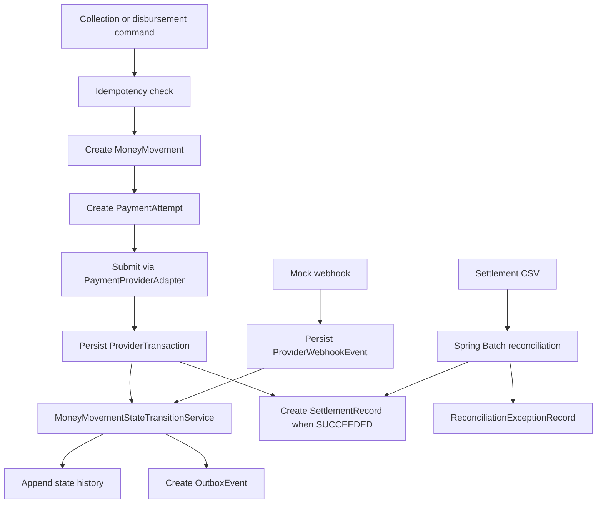
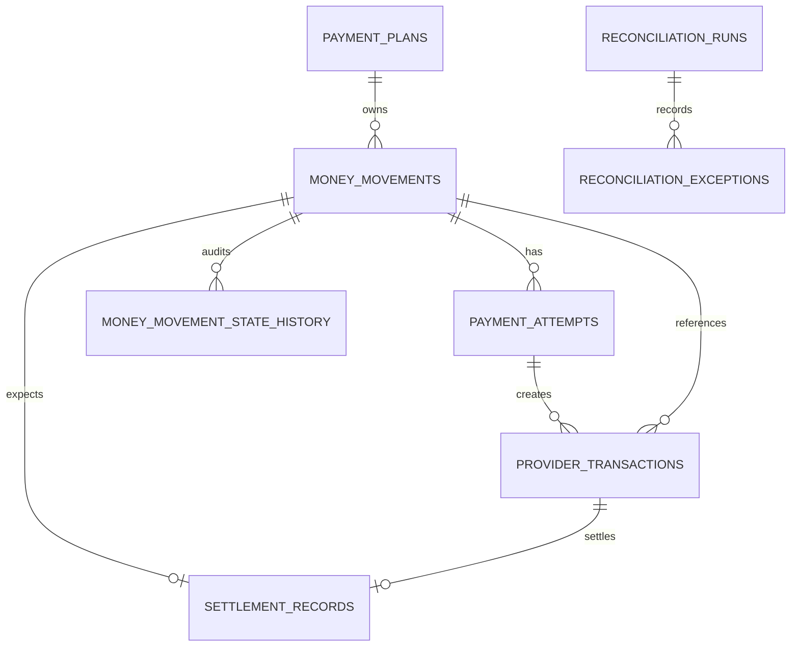
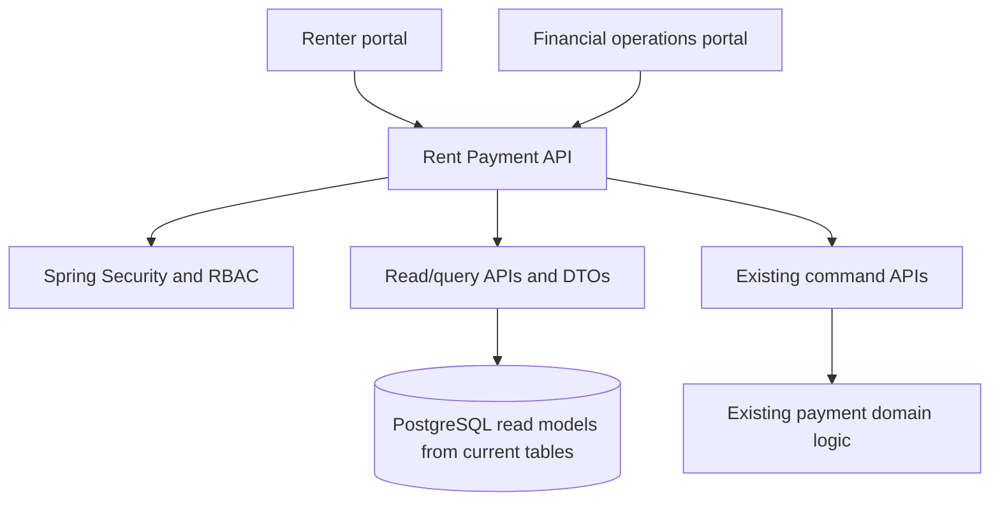

# Phase 1 Documentation Checkpoint

This document records the current repository state after Phase 1 Tasks 1-12 and the
first full-stack enablement slice. It is a checkpoint for implementation planning and
should remain consistent with
[`Flex_Rent_Payment_Project_Blueprint.md`](Flex_Rent_Payment_Project_Blueprint.md).

The blueprint remains canonical. This file describes what is actually implemented in
the repository today.

## Implemented Scope

Phase 1 Tasks 1-12 are implemented:

1. Payment plan and money movement model
2. Renter collection API
3. Property disbursement API
4. Stable idempotency keys and request fingerprints
5. Provider adapter plus deterministic mock implementation
6. Webhook ingestion and deduplication
7. State history and centralized transition hardening
8. Transactional outbox persistence
9. Scheduled local outbox publisher
10. One settlement record flow
11. Spring Batch reconciliation job using an S3-style input file
12. Chunk-oriented Spring Batch reconciliation hardening, including restartability,
    malformed-row handling, and integration coverage for duplicates, concurrency,
    webhook replay, rollback, publisher behavior, settlement, and reconciliation

Full-stack enablement started:

- Stateless Spring Security configuration
- Replaceable local/dev/test bearer-token principal
- Renter-scoped payment-plan and money-movement read APIs
- DTO responses for renter portal use
- Pagination through Spring `Pageable`
- Renter ownership checks for read and command endpoints
- FINOPS/ADMIN authorization for property disbursement commands

## Business Scope

The implemented service supports the payment-side lifecycle for renter collections and
property disbursements against an existing payment plan. The plan itself is treated as a
payment-side snapshot of an upstream Billing obligation.

The service does not own:

- Billing obligation creation
- Risk decisions
- Ledger platform internals
- Renter mobile or web UI
- Real provider credentials or network integration
- Finance operations manual workflows

## Current Backend Modules

| Module                 | Implemented responsibility                                                  |
|------------------------|-----------------------------------------------------------------------------|
| `paymentplan`          | Payment-side plan snapshot persistence                                      |
| `collection`           | Renter collection command endpoint and service                              |
| `disbursement`         | Property disbursement command endpoint and service                          |
| `provider`             | Provider adapter contract, normalized request/response, mock provider       |
| `webhook`              | Mock-provider webhook endpoint, signature check, dedupe, audit persistence  |
| `idempotency`          | Request fingerprinting, replay, conflict handling, expiration               |
| `shared/moneymovement` | Money movement, attempts, provider transactions, state history, transitions |
| `outbox`               | Transactional event rows, scheduler, publisher, mock event sink             |
| `settlement`           | Expected settlement record creation                                         |
| `reconciliation`       | Chunk-oriented Spring Batch file reconciliation                             |
| `security`             | Stateless security configuration and replaceable dev principal              |
| `renter`               | Renter portal read/query APIs and DTOs                                      |

## Current Runtime Flow



## Idempotency Checkpoint

Implemented:

- `Idempotency-Key` request header
- `operationKey` request-body field retained for API compatibility
- Normalized request fingerprinting
- PostgreSQL unique constraint on `(idempotency_key, operation)`
- Concurrent insert-race handling
- Completed response replay
- Conflicting reuse returns `409`
- In-progress duplicate returns `409`
- Expired record reuse returns `409`

Known gap:

- There is no cleanup scheduler for expired records yet.

## Provider And Webhook Checkpoint

Implemented:

- Provider adapter interface
- Deterministic mock adapter
- Normalized statuses for processing, failure, and ambiguous timeout
- Provider transaction persistence
- Ambiguous timeouts retained for later verification
- Mock-provider webhook endpoint
- Shared-secret verification
- Raw payload audit persistence
- Duplicate provider event handling through `(provider, provider_event_id)`
- Unknown transaction retention as unmatched
- Terminal-state and invalid-regression protection
- `occurredAt`-based stale-event detection remains future work

Known gaps:

- No real provider adapter
- No provider status polling
- No webhook reprocessing workflow
- No secure production secret integration

## Outbox Checkpoint

Implemented:

- Transactional outbox rows for meaningful money-movement state changes
- Stable stored JSON payload
- No event for no-op/rejected transitions or duplicate replay
- Scheduled publisher
- PostgreSQL `FOR UPDATE SKIP LOCKED` claiming
- Retry attempts, `next_attempt_at`, `last_error`, and terminal `FAILED` status
- Local mock event publisher

Known gaps:

- No real SNS publishing
- No SQS consumers
- No processed-event deduplication table
- No DLQ workflow

## Settlement And Reconciliation Checkpoint

Implemented settlement:

- One expected settlement record when a provider-backed money movement reaches
  `SUCCEEDED`
- Expected gross, fee, net, currency, settlement date, provider, and provider
  transaction reference
- Duplicate protection by money movement and provider transaction

Implemented reconciliation:

- `SettlementFileSource` abstraction
- Local file implementation
- Chunk-oriented Spring Batch job
- `FlatFileItemReader`, `ItemProcessor`, and `ItemWriter`
- Source-file uniqueness through `ReconciliationRun`
- Completed rerun deduplication
- Failed run restartability
- Malformed file failure with persisted run audit
- Missing settlement, amount mismatch, and duplicate provider-record exceptions

Known gaps:

- No real S3 implementation
- No status mismatch scenario yet
- No missing-provider comparison against expected internal records yet
- No finance operations queue or manual resolution workflow

## Persistence Model



Flyway migrations:

- `V1__create_payment_core_tables.sql`
- `V2__create_provider_webhook_events.sql`
- `V3__create_settlement_records.sql`
- `V4__create_reconciliation_tables.sql`

## Current API Surface

Command APIs:

- `POST /api/v1/renter-collections`
- `POST /api/v1/property-disbursements`
- `POST /api/v1/provider-webhooks/mock-provider`

Renter read APIs:

- `GET /api/v1/me/payment-plans`
- `GET /api/v1/me/payment-plans/{paymentPlanId}`
- `GET /api/v1/me/money-movements`
- `GET /api/v1/me/money-movements/{moneyMovementId}`

Renter list APIs default to `size=20` with newest-first sorting by `createdAt` descending.
Requested page sizes are capped at 100.

The `/api/v1/me/**` and collection endpoints require a local/dev/test bearer token with
role `RENTER`. Property disbursement requires role `FINOPS` or `ADMIN` and does not derive
renter ownership from the authenticated principal. The webhook endpoint remains protected
by provider shared-secret verification. There are no internal operations query APIs yet.

Local/dev token format:

```text
Authorization: Bearer dev:<subject>:<renterId>:<comma-separated-roles>
```

The dev bearer-token filter is profile-gated to `local`, `dev`, and `test`; it is not
registered for production profiles.

## Testing Checkpoint

Testing is PostgreSQL-backed through Testcontainers. The suite covers:

- Flyway schema validation
- JPA constraints
- renter collection command behavior
- property disbursement command behavior
- idempotent replay and conflicts
- concurrent duplicate idempotency handling
- provider result handling
- webhook processing and deduplication
- state-transition rules
- transactional outbox behavior
- scheduled outbox publisher success, retry, permanent failure, and concurrency
- settlement expectation creation
- reconciliation matching, malformed rows, reruns, and restartability
- stateless dev-principal authentication
- renter role enforcement
- renter-scoped read API pagination and ownership protection
- command endpoint payment-plan ownership protection
- FINOPS/ADMIN authorization for property disbursement
- production-profile absence of the dev bearer-token filter

## Local Development Checkpoint

Current local assumptions:

- Java 17
- Gradle wrapper
- PostgreSQL available at `jdbc:postgresql://localhost:5432/rent_payment`
- Flyway-managed schema
- `spring.batch.job.enabled=false`
- `spring.batch.jdbc.initialize-schema=always`
- Testcontainers for integration tests

There is currently no Docker Compose configuration in the repository.

## Full-Stack Architecture Direction

The next enterprise-style evolution should build on the new renter-scoped read APIs
without changing the payment execution, webhook, outbox, settlement, or reconciliation
domain logic.



Recommended roles:

- `RENTER`
- `SUPPORT`
- `FINOPS`
- `ADMIN`

Recommended renter pages:

- Dashboard
- Payment plan detail
- Money movement history
- Collection initiation
- Payment status/result

Recommended operations pages:

- Operations dashboard
- Money movements
- Money movement detail with state history
- Provider transactions
- Webhook events
- Outbox events
- Settlement records
- Reconciliation runs
- Reconciliation exceptions

Remaining backend gaps:

- Production OAuth2/JWT resource-server integration
- Operations query APIs
- Support and finance-operations role surfaces
- Filtering by state/status/type/provider/date
- Constrained exact search by IDs and provider references
- CORS configuration for a frontend dev server

Recommended React/TypeScript structure:

```text
frontend/
  src/
    app/
    auth/
    api/
    pages/
      renter/
      ops/
    components/
      layout/
      tables/
      filters/
      status/
      money/
      forms/
      feedback/
    hooks/
    utils/
```

## Production Direction

Future production hardening should add:

- S3-backed settlement file source
- Real SNS/SQS publishing and consumers
- Processed-event deduplication
- SQS DLQs, alarms, and replay runbooks
- Secure secret management
- OAuth2/JWT integration
- Actuator, Micrometer metrics, structured logging, tracing
- Datadog and CloudWatch dashboards
- Docker/ECR/EKS deployment artifacts
- Operational runbooks for provider ambiguity, webhook replay, outbox failures,
  settlement mismatches, and reconciliation failures

## Recommended Next Vertical Slice

Continue with the renter portal slice:

1. Scaffold a React/TypeScript frontend.
2. Add auth token handling for local/dev.
3. Add renter dashboard and payment-plan detail page.
4. Read payment plans and money movements from `/api/v1/me/**`.
5. Reuse the existing collection command endpoint with idempotency and renter ownership
   checks.

This creates a real full-stack path without disturbing the established financial domain
logic.
